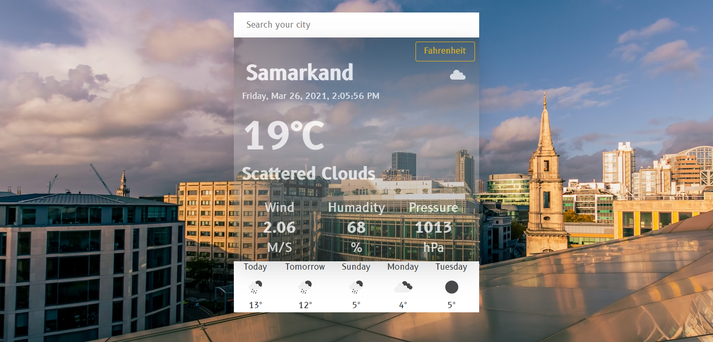

# Weather App

> The Weather App project comes at the end of the Asynchronous Javascript and APIs section of the Javascript course in Microverse. It tests the knowledge of the student about asynchronous communication with promises or async/await and when to use them.[You can find the original project specification from here.](https://www.theodinproject.com/courses/javascript/lessons/weather-app)

# Project Objectives

Use everything we’ve been discussing to create a weather forecast site using the weather API from the previous lesson. You should be able to search for a specific location and toggle displaying the data in Fahrenheit or Celsius.

You should change the look of the page based on the data, maybe by changing the color of the background or by adding images that describe the weather. (You could even use the Giphy API to find appropriate weather-related gifs and display them). Feel free to use promises or async/await in your code, though you should try to become comfortable with both.

## Live Demo

-[live-version](https://weather-app-murod.netlify.app/)

## Built with

- JavaScript
- Webpack
- HTML
- CSS
- Bootstrap
- API

## Getting Started

- Clone the repo `git@github.com:Murodjon000/weather-js.git`
- cd `into` the project
- Run `git pull origin app`
- Run `yarn install` or `npm install` to install dependencies
- On the terminal run `npm run start` open up the live server

## Author

👤 **Shiva Chauhan**

## 🤝 Contributing

Contributions, issues and feature requests are welcome!

Feel free to check the [issues page](issues/).

## Show your support

Give a ⭐️ if you like this project!

## 📝 License

MIT License
